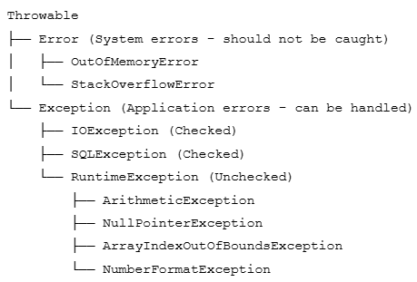

### **What is an Exception?**

An **exception** is an event that occurs during program execution that disrupts the normal flow of instructions. When an error occurs within a method, the method creates an object called an **exception object** and hands it off to the runtime system.

### **Real-Life Analogy**

Think of driving a car. Normally, you drive smoothly from point A to point B. But sometimes, unexpected events occur: a flat tire, running out of gas, or a road closure. These are like *exceptions* - they interrupt your normal journey. You need to *handle* these situations: change the tire, refuel, or take a detour.

### **Why Exception Handling?**

* **Program Stability: **Prevent program crashes
* **Error Recovery: **Attempt to recover from errors
* **User-Friendly: **Provide meaningful error messages
* **Debugging: **Help identify and fix issues
* **Separation of Concerns: **Separate error-handling code from regular code

## **Exception Hierarchy**

### **2.1 The Exception Class Hierarchy**

All exceptions in Java inherit from the **Throwable** class. The hierarchy has two main branches:

## **Checked vs Unchecked Exceptions**

### **Checked Exceptions**

**Checked exceptions** are exceptions that are  **checked at compile-time** . The compiler forces you to either handle them (using try-catch) or declare them (using throws).

**Common Checked Exceptions:**

* **IOException: **Input/output operations failed
* **FileNotFoundException: **File not found
* **SQLException: **Database access error
* **ClassNotFoundException: **Class not found

***Example:***

***Important: ****If you don't handle checked exceptions, your code will not compile! The compiler will give you an error.*

### **Unchecked Exceptions**

**Unchecked exceptions** (also called  *runtime exceptions* ) are exceptions that are  **not checked at compile-time** . They occur during program execution and usually indicate programming errors.

**Common Unchecked Exceptions:**

* **NullPointerException: **Accessing null reference
* **ArithmeticException: **Arithmetic error (e.g., divide by zero)
* **ArrayIndexOutOfBoundsException: **Array index invalid
* **NumberFormatException: **String to number conversion failed
* **IllegalArgumentException: **Invalid argument passed

***Example:***

### **Comparison Table**

### **Throwing Exceptions**

### **a. **The throw Keyword

You can manually **throw** an exception using the **throw** keyword. This is useful when you want to signal that an error condition has occurred.

**Syntax:**

throw new ExceptionType("Error message");

***Example:***

### **b. The throws Keyword**

The **throws** keyword is used in method signatures to declare that a method might throw certain exceptions. The caller must handle these exceptions.

***Example:***

***Difference: throw ****is used to actually throw an exception, while ****throws ****is used to declare that a method might throw an exception.*

## **Exception Propagation**

### **What is Exception Propagation?**

**Exception propagation** is the process by which an exception is passed up the call stack from the method where it occurred to the calling method, until it is either caught or reaches the main method.

### **How It Works**

When an exception occurs:

1. Java looks for a catch block in the current method
2. If not found, the exception is thrown to the calling method
3. This continues up the call stack
4. If no handler is found, the program terminates

***Example:***

***Call Stack: ****method3() → method2() → method1(). The exception bubbles up until it's caught in method1().*

## **User-Defined Exceptions**

### **Why Create Custom Exceptions?**

* To represent specific error conditions in your application
* To provide more meaningful error messages
* To categorize exceptions specific to your business logic
* To add custom fields and methods

### **Creating Custom Checked Exception**

***InsufficientFundsException.java***

***BankAccount.java***

### **Creating Custom Unchecked Exception**

***InvalidAgeException.java***

***Usage Example:***

### ** Exception Hierarchy Best Practices**

Create a hierarchy of custom exceptions for better organization:

***Benefit: ****You can catch all bank-related exceptions with catch(BankException e) or handle specific ones individually.*

## ** Multiple Catch Blocks and Try-with-Resources**

### **Multiple Catch Blocks**

You can have multiple catch blocks to handle different types of exceptions differently.

***Important: ****Catch blocks must be ordered from most specific to most general. The more specific exception must come first!*

### **Try-with-Resources**

Introduced in Java 7, **try-with-resources** automatically closes resources (like files) when the try block finishes, even if an exception occurs.

***Old Way (without try-with-resources):***

***New Way (with try-with-resources):***

***Benefit: ****Cleaner code, automatic resource management, prevents resource leaks.*
